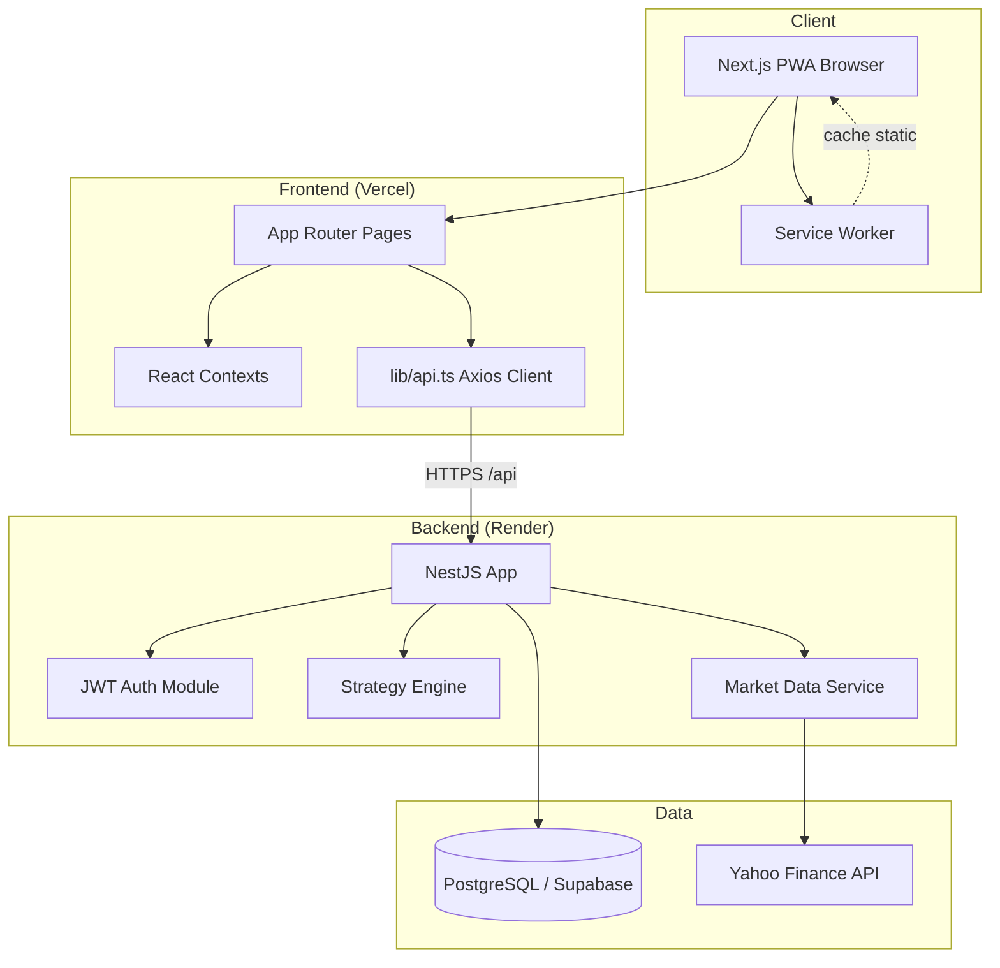
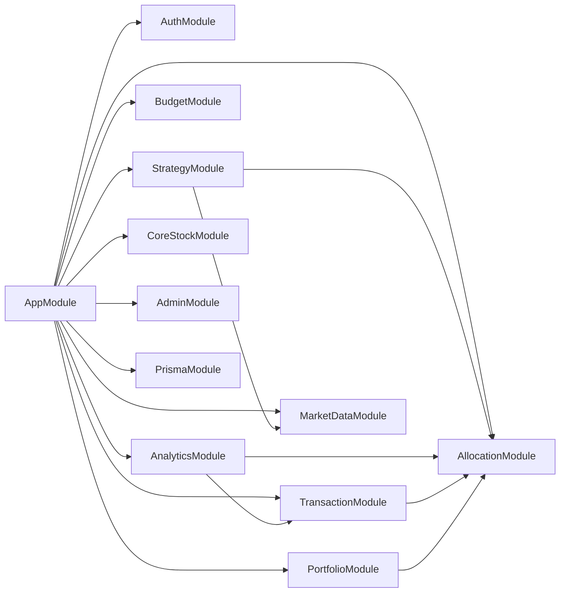
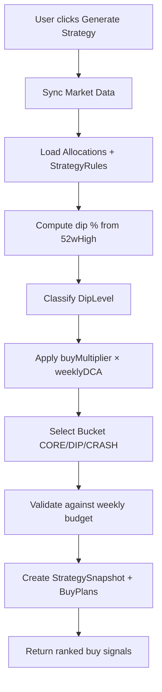
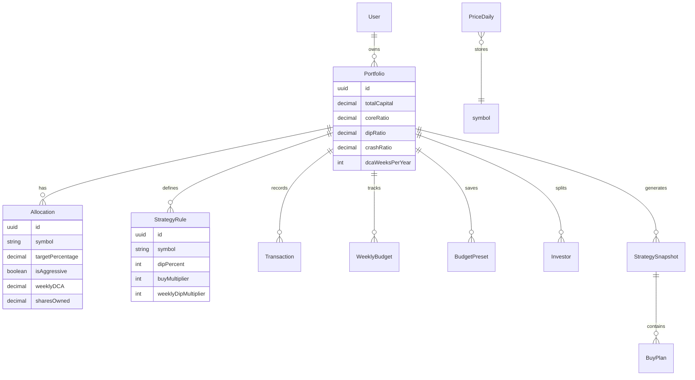
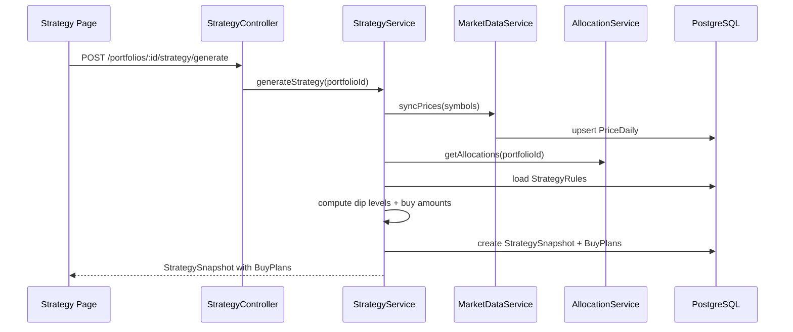
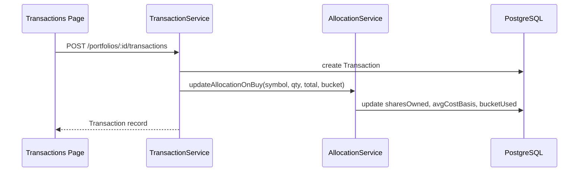
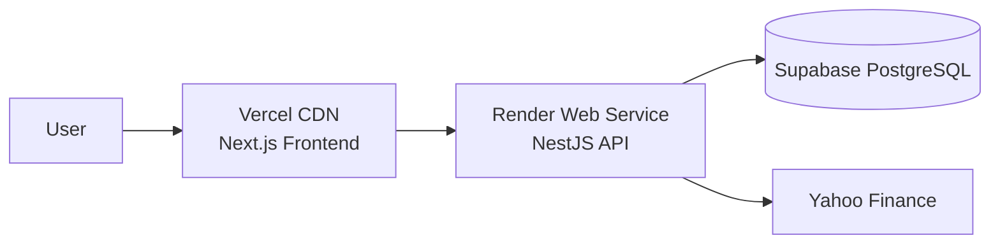

# CapitalForge — Architecture

> **Version:** 1.0 · **Last updated:** 2026-05-24

---

## How AI Agents Should Use This Document

- Consult before adding new modules, services, or cross-cutting concerns.
- Follow existing boundaries — do not merge unrelated domains into one service.
- Add Mermaid diagrams when introducing new flows; update existing diagrams when flows change.
- Cross-reference `API_CONTRACTS.md` for endpoint details and `DECISION_LOG.md` for rationale.

---

## High-Level Architecture

CapitalForge is a **modular monolith**: a NestJS API backend and a Next.js SPA frontend, sharing a PostgreSQL database via Prisma ORM. Market data is fetched on-demand from Yahoo Finance (no message queue in V1).



---

## Frontend Architecture

### Stack

- **Next.js 16** App Router with React Server Components where applicable
- **Client components** for interactive pages (strategy table, charts, forms)
- **TanStack Query** for server-state caching (where adopted)
- **React Context** for auth (`auth-context.tsx`) and active portfolio (`portfolio-context.tsx`)
- **Axios** centralized in `lib/api.ts` with JWT interceptor

### Page Map

| Route | Component | Data Sources |
|-------|-----------|--------------|
| `/` | Dashboard | analyticsApi, portfolioApi |
| `/strategy` | Strategy table + buy signals | strategyApi, marketDataApi |
| `/allocation` | Allocation management | allocationApi |
| `/transactions` | Transaction ledger | transactionApi |
| `/budget` | Budget presets + weekly | budgetApi, portfolioApi |
| `/analytics` | Charts, dip opportunities | analyticsApi |
| `/settings` | Portfolio config | portfolioApi |
| `/auth/login` | Auth forms | authApi |

### Component Layers

```
app/layout.tsx          → ThemeProvider, AuthProvider, PortfolioProvider, AppShell
components/layout/      → sidebar, header, bottom-tab-bar, app-shell
components/ui/            → shadcn primitives (button, card, table, dialog...)
lib/api.ts              → All HTTP calls
lib/types.ts            → Shared TypeScript interfaces
```

### State Management Rules

| State Type | Mechanism | Example |
|------------|-----------|---------|
| Auth session | Context + localStorage token | `auth-context.tsx` |
| Active portfolio | Context | `portfolio-context.tsx` |
| Server data | Direct API calls / React Query | Strategy snapshots |
| UI ephemeral | useState in page/component | Modal open, form fields |
| Budget preview | Client-side computation | What-if totalBudget (planned) |

### PWA / Offline

- Service worker (`public/sw.js`): network-first for pages, skip API routes
- Cached static assets for shell; show offline message on network failure
- Market data gracefully degrades to last synced prices

---

## Backend Architecture

### Module Structure

Each domain is a self-contained NestJS module:

```
Module
├── *.module.ts       # Imports, providers, exports
├── *.controller.ts   # HTTP routes, DTO validation
├── *.service.ts      # Business logic
└── dto/
    └── *.dto.ts      # Request/response shapes
```

### Module Dependency Graph



### Cross-Cutting Concerns

| Concern | Implementation |
|---------|---------------|
| Config | `@nestjs/config` global, `.env` |
| Validation | Global `ValidationPipe` (whitelist, transform) |
| Errors | `AllExceptionsFilter` → consistent JSON envelope |
| Auth | `JwtAuthGuard` + `@Public()` decorator |
| DB access | `PrismaService` injected per module |

### Strategy Engine (Core Domain)

The strategy engine is the heart of CapitalForge:



**Key files:**
- `backend/src/strategy/strategy.service.ts` — generation, execution
- `backend/src/allocation/allocation.service.ts` — bucket recalculation
- `backend/src/market-data/market-data.service.ts` — Yahoo sync

---

## Database Architecture

### Provider

PostgreSQL via Supabase (production) with connection pooling (`DATABASE_URL`) and direct connection for migrations (`DIRECT_URL`).

### Entity Relationship (Core)



### Indexing Strategy

- All foreign keys indexed (`portfolioId`, `userId`)
- Composite: `(portfolioId, symbol)` on allocations, strategy rules
- `(symbol, date)` on `prices_daily` for chart queries
- `(portfolioId, date)` on transactions for filtered ledger

### Migration Strategy

- Prisma Migrate for all schema changes
- Naming: `YYYYMMDDHHMMSS_description`
- Never edit applied migrations — create new ones
- Seed script supports Excel import from repo root

---

## Event Flow

V1 has **no message broker**. Events are synchronous HTTP request/response.

### Strategy Generation Flow



### Transaction Recording Flow



---

## Authentication Flow

See `PROJECT_CONTEXT.md` for sequence diagram.

**JWT payload:** `{ sub: userId, email }`  
**Expiration:** configurable via `JWT_EXPIRATION` (default 7d)  
**Password:** bcrypt hashed on register

**Security debt:** `AuthBypassMiddleware` must be removed — see `KNOWN_ISSUES.md`.

---

## API Flow

All routes prefixed with `/api`. See `API_CONTRACTS.md` for full catalog.

**Typical authenticated request:**

```
GET /api/portfolios/:id/allocations
Authorization: Bearer eyJhbG...
→ 200 [ Allocation[] ]
```

**Typical error:**

```
POST /api/portfolios (invalid body)
→ 400 { success: false, statusCode: 400, message: [...], timestamp }
```

---

## Deployment Architecture



| Component | Platform | Notes |
|-----------|----------|-------|
| Frontend | Vercel | `NEXT_PUBLIC_API_URL` points to Render |
| Backend | Render | Health check: `GET /api/health` |
| Database | Supabase | Pooled + direct URLs |
| DNS/SSL | Platform-managed | — |

Details: `DEPLOYMENT_GUIDE.md`

---

## Caching Strategy

| Layer | Strategy | TTL |
|-------|----------|-----|
| Browser (SW) | Static assets, shell pages | Until SW version bump |
| Frontend (React Query) | API responses where adopted | Stale-while-revalidate |
| Backend | None in V1 | — |
| Database | PriceDaily table | 90 days retention (target) |
| Yahoo Finance | No server-side cache beyond DB | On-demand sync |

**Principle:** Market prices are synced explicitly (user action or strategy generation), stored in `prices_daily`, and served from DB thereafter.

---

## Queue / Event Strategy

**V1:** No queue. All operations synchronous.

**Future (V2+):**
- Scheduled market sync via Render cron or BullMQ
- Email notifications on dip threshold breach
- Consider event sourcing for transaction audit trail

Document any queue introduction in `DECISION_LOG.md`.

---

## Error Handling Strategy

### Backend

- Global `AllExceptionsFilter` catches all exceptions
- `HttpException` → appropriate status code + message
- Unhandled errors → 500 with logged stack trace
- Validation errors → 400 with field array

### Frontend

- Axios interceptor: 401 → clear token, redirect to login
- Toast notifications (sonner) for user-facing errors
- Graceful degradation: show last known prices if sync fails

### Error Response Shape

```json
{
  "success": false,
  "statusCode": 400,
  "message": "Validation failed",
  "errors": ["targetPercentage must not exceed 100"],
  "timestamp": "2026-05-24T12:00:00.000Z"
}
```

---

## Scalability Considerations

| Concern | Current | Future Path |
|---------|---------|-------------|
| Users | Single-tenant family use | Row-level security via userId on Portfolio |
| Stocks per portfolio | 5–20 | Fine with current design |
| Transactions | Hundreds | Add pagination (G-14), indexes exist |
| Market sync | Sequential Yahoo calls | Batch + rate limit handling |
| Strategy compute | In-request | Could cache snapshot for 1 hour |
| Database | Supabase free/pro tier | Connection pooling already configured |

**Horizontal scaling:** Backend is stateless (JWT); multiple Render instances possible. Database is the bottleneck — monitor connection pool usage.

---

## Related Documents

- [PROJECT_CONTEXT.md](./PROJECT_CONTEXT.md) — Business rules, conventions
- [API_CONTRACTS.md](./API_CONTRACTS.md) — Endpoint specs
- [DEPLOYMENT_GUIDE.md](./DEPLOYMENT_GUIDE.md) — Deploy procedures
- [DECISION_LOG.md](./DECISION_LOG.md) — Architecture decisions
