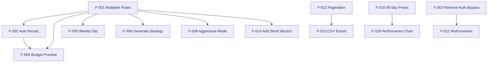

# CapitalForge — Feature Backlog

> **Version:** 1.0 · **Last updated:** 2026-05-24  
> **Sprint:** 2026-W21 (May 19–25)

---

## How AI Agents Should Use This Document

1. **Check before starting work** — find the feature ID, read acceptance criteria and dependencies.
2. **Update status** when you begin (`In Progress`), finish (`Done`), or hit a blocker.
3. **Do not start P2 items** unless P0/P1 for the same module are complete or explicitly waived.
4. **Link PRs** in the Notes column when merging.

---

## Status Legend

| Status | Meaning |
|--------|---------|
| `Backlog` | Not started |
| `In Progress` | Active development |
| `Review` | PR open, awaiting merge |
| `Done` | Merged and verified |
| `Blocked` | Cannot proceed — see Blockers column |

---

## Feature Backlog

| ID | Feature | Priority | Status | Owner | Sprint | Dependencies | Acceptance Criteria | Progress | Blockers | Next Actions |
|----|---------|----------|--------|-------|--------|--------------|---------------------|----------|----------|--------------|
| F-001 | Multiplier-based strategy rules | P0 | In Progress | — | W21 | Schema migrated | StrategyRule stores `buyMultiplier`; buyUSD = weeklyDCA × multiplier; no `strategyReferenceBudget` | 70% | Legacy seed data may still use quantities | Finish strategy.service rewrite; update seed |
| F-002 | Auto-recalculate buckets on budget change | P0 | In Progress | — | W21 | F-001 | Changing `totalCapital` or ratios triggers `recalculateBuckets()` automatically | 50% | Not wired in all update paths | Hook into `portfolio.update()` and `applyBudgetPreset()` |
| F-003 | Remove JWT auth bypass | P0 | Backlog | — | W21 | — | `AuthBypassMiddleware` removed; all routes except `@Public()` require valid JWT | 0% | Dev convenience dependency | Remove middleware; test all pages |
| F-004 | Budget Preview widget | P1 | Backlog | — | W22 | F-002 | User types hypothetical budget; table updates client-side; "Apply" persists | 0% | — | Implement in `/budget` and `/strategy` pages |
| F-005 | Weekly Dip Buy trigger | P1 | Backlog | — | W22 | F-001 | Track `lastWeeklyBuyPrice`; flag when price drops ≥3% intra-week at active dip level | 0% | Schema fields exist, logic missing | Implement in strategy.service + UI badge |
| F-006 | Transaction reversal on edit/delete | P1 | Backlog | — | W22 | — | Edit/delete fully reverses shares, avg cost, bucket usage, weekly budget | 0% | — | Add reversal service in transaction.service |
| F-007 | Fix executeBuyPlan bucket decrement | P1 | Backlog | — | W21 | — | `executeBuyPlan` decrements `*RemainingUSD` not just incrementing used | 0% | — | One-line fix in strategy.service |
| F-008 | Strategy generate uses multiplier rules | P0 | In Progress | — | W21 | F-001 | `generateStrategy()` respects per-stock multipliers, not equal-split | 40% | Current equal-split logic | Rewrite generate loop per PRD §5.2 |
| F-009 | Aggressive mode (VONG) | P1 | Backlog | — | W22 | F-001 | `isAggressive` flag changes multipliers at 15%/20% dip levels | 20% | Schema ready | Wire multiplier lookup in strategy engine |
| F-010 | Price history 90-day retention | P2 | Backlog | — | W23 | — | PriceDaily retains 90 days; chart shows meaningful range | 10% | Currently ~14 days | Update market-data cleanup job |
| F-011 | Multi-investor UI | P2 | Backlog | — | W23 | — | Shashi/Lucky contributions tracked; per-investor P&L shown | 10% | Investor model exists | Build settings UI + analytics split |
| F-012 | Transaction pagination | P2 | Backlog | — | W23 | — | Backend skip/take; frontend paginated table (50/page) | 0% | — | Add to transaction.controller + page |
| F-013 | CSV export | P2 | Backlog | — | W23 | F-012 | Export full transaction history as CSV download | 0% | — | Add export endpoint + frontend button |
| F-014 | Add stock wizard | P2 | Backlog | — | W24 | F-001 | UI flow to add symbol, 52w high, target %, default rules | 0% | — | New dialog on allocation page |
| F-015 | 52w high staleness warning | P2 | Backlog | — | W24 | — | Strategy screen warns if `fiftyTwoWeekHighUpdatedAt` > 90 days | 0% | — | UI badge + tooltip |
| F-016 | Performance chart fix | P2 | Backlog | — | W23 | F-010 | Daily portfolio value computed from price history × shares | 0% | Returns single data point | Rewrite analytics.service |
| F-017 | PWA offline polish | P3 | In Progress | — | W21 | — | SW caches shell; offline message; manifest icons | 60% | — | Test offline strategy page |
| F-018 | Dashboard stat cards | P1 | Done | — | W20 | — | Portfolio value, P&L, budget, weekly DCA total displayed | 100% | — | Maintain |
| F-019 | Market data sync | P1 | Done | — | W19 | — | Yahoo sync on demand; prices stored in DB | 100% | — | Maintain |
| F-020 | Excel seed import | P1 | Done | — | W18 | — | Seed imports from `Stocks Strategy.xlsx` if present | 100% | — | Maintain |

---

## Sprint Tracking

### Sprint 2026-W21 (Current)

| Metric | Value |
|--------|-------|
| **Goal** | Complete P0 strategy engine rewrite + auth hardening |
| **Committed** | F-001, F-002, F-003, F-007, F-008 |
| **Completed** | — |
| **Carry-over** | F-001, F-008 from W20 |

### Sprint 2026-W22 (Planned)

| Metric | Value |
|--------|-------|
| **Goal** | Budget preview + weekly dip + transaction reversal |
| **Committed** | F-004, F-005, F-006, F-009 |

---

## Risk Register

| Risk | Impact | Likelihood | Mitigation |
|------|--------|------------|------------|
| Yahoo Finance API changes/blocks | High | Medium | Cache in PriceDaily; graceful fallback UI |
| Strategy engine rewrite breaks seed data | High | Medium | Integration tests against Excel expected values |
| Auth bypass removal breaks dev workflow | Medium | High | Document login flow; keep demo credentials |
| Decimal rounding drift vs Excel | Medium | Medium | Unit tests with known Excel values ($73.87 etc.) |
| Render cold start latency | Low | High | Health check ping; loading skeletons in UI |

---

## Dependency Map



---

## Adding New Features

Use this template when adding rows:

```markdown
| F-0XX | [Feature name] | P[0-3] | Backlog | [owner] | W[XX] | [deps] | [criteria] | 0% | — | [next step] |
```

Update this file in the same PR that implements the feature.
