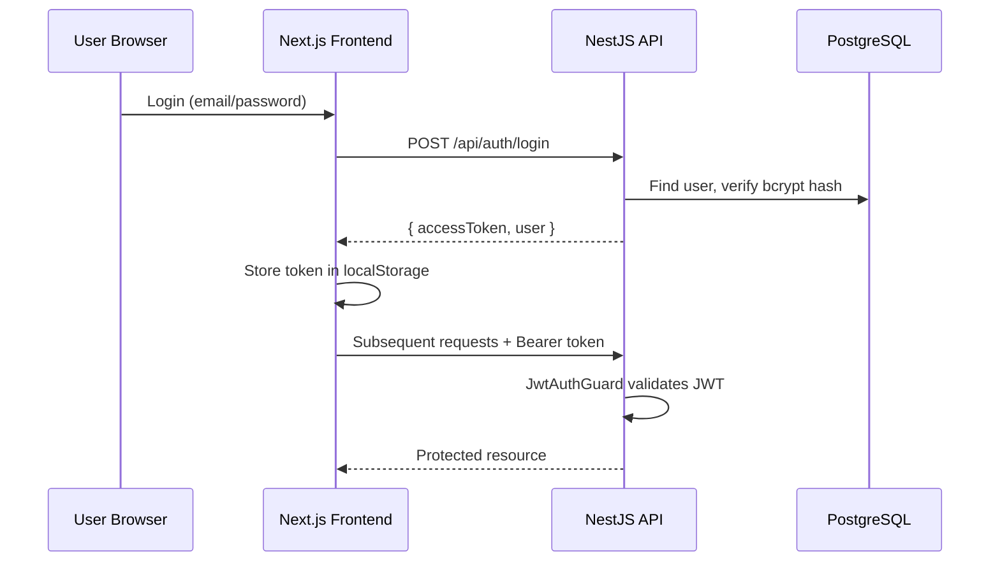

# CapitalForge — Project Context

> **Version:** 1.0 · **Last updated:** 2026-05-24  
> **Primary reference for all Cursor agents.** Read this file first in every new chat.

---

## How AI Agents Should Use This Document

1. **Read fully before coding** — this file replaces re-scanning the repo for business context.
2. **Cross-reference, don't duplicate** — use links to `ARCHITECTURE.md`, `API_CONTRACTS.md`, and skills for depth.
3. **Update on change** — if you alter business rules, tech stack, or module boundaries, update this file in the same PR.
4. **Scope strictly** — only touch modules listed under "Current Active Modules" unless the task explicitly expands scope.
5. **Log work** — append to `TIME_LOG.md` and update `FEATURE_BACKLOG.md` when completing tasks.

---

## Business Overview

**CapitalForge** is a rule-based portfolio capital deployment system that replaces a manual Excel workflow (`Stocks Strategy.xlsx`) used by two investors (Shashi + Lucky) to manage a 5–6 stock buy-and-hold portfolio.

The spreadsheet tracks:
- Yearly capital budget and per-stock target allocations
- Three-bucket deployment (Core 60% / Dip 30% / Crash 10%)
- Weekly DCA amounts derived from budget
- Dip-level buy rules based on distance from 52-week high
- Transaction ledger and position performance

**CapitalForge automates** data entry, real-time decision computation, market data sync, and audit-trail tracking while preserving the Excel logic as the source of truth (see `PRD.md` at repo root).

---

## Product Vision

> Replace spreadsheet-driven investment decisions with a production-grade web app that computes buy signals in real time, scales cleanly when budget changes, and maintains a complete audit trail — without requiring manual recalculation.

**North-star metrics:**
- User can change `totalBudget` once and see all downstream DCA/buy amounts update instantly
- Strategy screen shows actionable buy signals within 5 seconds of market sync
- Zero drift between transactions, bucket usage, and position state

---

## Current Goals (Q2 2026)

| Priority | Goal | Status |
|----------|------|--------|
| P0 | Multiplier-based strategy engine (not raw share quantities) | In progress |
| P0 | Auto-recalculate buckets on budget/ratio changes | Partial |
| P0 | Remove global JWT auth bypass | Open |
| P1 | Budget Preview widget (client-side what-if) | Not started |
| P1 | Weekly Dip Buy intra-week trigger | Not started |
| P1 | Transaction edit/delete reversal logic | Not started |
| P2 | Multi-investor P&L (Shashi/Lucky split) | Schema ready |
| P2 | CSV export, paginated transactions | Not started |

See `FEATURE_BACKLOG.md` for full tracking.

---

## Tech Stack

| Layer | Technology | Version / Notes |
|-------|-----------|-----------------|
| **Backend** | NestJS | 11.x, TypeScript |
| **ORM** | Prisma | 6.x |
| **Database** | PostgreSQL | Supabase (prod) or local |
| **Auth** | JWT + Passport | bcrypt password hashing |
| **Market Data** | yahoo-finance2 | On-demand sync |
| **Frontend** | Next.js App Router | 16.x, React 19 |
| **Styling** | TailwindCSS 4 + shadcn/ui | Radix primitives |
| **Charts** | Recharts | Dashboard/analytics |
| **State** | React Context + TanStack Query | Auth, portfolio |
| **PWA** | Service Worker | Network-first, offline fallback |
| **Deployment** | Render (backend), Vercel (frontend) | See `DEPLOYMENT_GUIDE.md` |

---

## Folder Structure

```
CapitalForge/
├── PRD.md                          # Product requirements (source of truth for business logic)
├── project-operating-system/       # THIS SYSTEM — agent memory & rules
│   ├── docs/                       # Architecture, backlog, decisions, logs
│   ├── skills/                     # Reusable agent instruction packs
│   └── .cursor/rules/              # Cursor rule files
├── backend/
│   ├── src/
│   │   ├── auth/                   # JWT registration, login, profile
│   │   ├── portfolio/              # Portfolio CRUD, budget presets
│   │   ├── allocation/             # Stock allocations, bucket recalc
│   │   ├── strategy/               # Strategy engine, buy plans, snapshots
│   │   ├── budget/                 # Weekly budget records
│   │   ├── transaction/            # Ledger CRUD, import
│   │   ├── market-data/            # Yahoo Finance sync
│   │   ├── analytics/              # Charts, dip opportunities, performance
│   │   ├── core-stock/             # Core stock list per portfolio
│   │   ├── admin/                  # Admin utilities
│   │   ├── common/                 # Filters, DTOs, decorators
│   │   └── prisma/                 # Prisma module
│   └── prisma/
│       ├── schema.prisma           # Database schema
│       ├── migrations/             # SQL migrations
│       └── seed.ts                 # Demo + Excel import seed
└── frontend/
    └── src/
        ├── app/                    # Pages: dashboard, strategy, allocation, etc.
        ├── components/             # UI (layout/, ui/)
        ├── contexts/               # auth-context, portfolio-context
        └── lib/                    # api.ts, types.ts, utils.ts
```

---

## Coding Conventions

| Area | Convention |
|------|-----------|
| **Language** | TypeScript everywhere; strict mode |
| **Backend modules** | One NestJS module per domain (`*.module.ts`, `*.service.ts`, `*.controller.ts`, `dto/`) |
| **DTOs** | class-validator decorators; whitelist enforced globally |
| **Money** | Prisma `Decimal` (18,2 for USD; 18,4 for prices); never use JS `number` for money in persistence |
| **IDs** | UUID v4 via Prisma `@default(uuid())` |
| **Frontend pages** | App Router `page.tsx` under `src/app/<route>/` |
| **API client** | Centralized in `frontend/src/lib/api.ts` — never scatter axios calls |
| **Components** | shadcn/ui in `components/ui/`; layout in `components/layout/` |
| **Naming** | camelCase (TS), kebab-case (files/routes), PascalCase (components/classes) |

---

## API Conventions

- **Base path:** `/api` (NestJS global prefix)
- **Auth header:** `Authorization: Bearer <jwt>`
- **Response envelope (errors):** `{ success: false, statusCode, message, errors, timestamp }`
- **Success responses:** Raw DTO or array (no wrapper on success)
- **Validation:** 400 with field-level errors via ValidationPipe
- **Portfolio scoping:** Most routes under `/api/portfolios/:id/...`

Full contract: `API_CONTRACTS.md`

---

## Authentication Flow



**Known issue:** `AuthBypassMiddleware` currently injects the first DB user on all requests — **must be removed** before multi-user production (see `KNOWN_ISSUES.md`, gap G-16 in PRD).

**Public routes:** `@Public()` decorator on register/login endpoints.

---

## Environments

| Environment | Frontend | Backend | Database |
|-------------|----------|---------|----------|
| **Local** | `localhost:3000` | `localhost:3001` | Local PG or Supabase |
| **Production** | Vercel | Render (`capitalforge.onrender.com`) | Supabase |

**Key env vars:**

| Variable | Location | Purpose |
|----------|----------|---------|
| `DATABASE_URL` | backend/.env | Pooled PG connection |
| `DIRECT_URL` | backend/.env | Direct PG for migrations |
| `JWT_SECRET` | backend/.env | Token signing |
| `NEXT_PUBLIC_API_URL` | frontend/.env.local | API base URL |
| `CORS_ORIGINS` | backend/.env | Additional allowed origins |

Bucket ratios are **per-portfolio in DB** (`coreRatio`, `dipRatio`, `crashRatio`), not env vars. Defaults: 0.60 / 0.30 / 0.10.

---

## Important Business Rules

### Budget Derivation Chain (Critical)

```
totalBudget (Portfolio.totalCapital)
  → allocationUSD = totalBudget × targetPercent / 100
  → coreBucketUSD = allocationUSD × coreRatio
  → weeklyDCA = coreBucketUSD / dcaWeeksPerYear  (default 48)
  → buyUSD at dip level = weeklyDCA × buyMultiplier (1, 3, or 5)
  → buyShares = floor(buyUSD / currentPrice)
```

**Strategy rules store multipliers, not raw USD or share counts.**

### Dip Levels

| Dip from 52w High | Level | Normal Multiplier | Aggressive Multiplier |
|-------------------|-------|-------------------|----------------------|
| < 10% | NORMAL_DCA | 1× | 1× |
| 10–15% | LIGHT_DIP | 1× | 1× |
| 15–20% | MODERATE_DIP | 1× | 3× |
| 20–30% | DIP_BUCKET | 3× | 5× |
| ≥ 30% | CRASH_BUCKET | 5× | 5× |

**Aggressive mode** (`Allocation.isAggressive = true`) applies to ETFs like VONG.

### Bucket Selection

- ≥ 30% dip → Crash bucket (fallback to Dip if exhausted)
- ≥ 20% (or 15% aggressive) → Dip bucket
- Otherwise → Core bucket

### Transaction Side Effects

- **BUY:** increment shares, recalc avg cost, increment bucket `*UsedUSD`, decrement `*RemainingUSD`
- **SELL:** decrement shares; bucket usage NOT restored
- **Edit/Delete:** must fully reverse original side effects (currently incomplete — G-06)

---

## Current Active Modules

| Module | Backend | Frontend Page | Maturity |
|--------|---------|---------------|----------|
| Auth | `auth/` | `/auth/login`, `/auth/register` | Functional (bypass issue) |
| Dashboard | `analytics/` | `/` | Functional |
| Strategy | `strategy/` | `/strategy` | Core — needs multiplier rewrite |
| Allocation | `allocation/` | `/allocation` | Functional |
| Transactions | `transaction/` | `/transactions` | Functional, no pagination |
| Budget | `budget/`, `portfolio/` | `/budget` | Partial — no preview |
| Analytics | `analytics/` | `/analytics` | Functional |
| Settings | `portfolio/` | `/settings` | Partial |
| Market Data | `market-data/` | (sync buttons) | Functional |

**Do not refactor unrelated modules.** If fixing strategy, stay in `strategy/`, `allocation/`, and related frontend pages.

---

## Future Roadmap

| Phase | Features |
|-------|----------|
| **V1.1** | Multiplier engine, budget preview, weekly dip trigger, auth hardening |
| **V1.2** | Multi-investor UI, CSV export, transaction pagination |
| **V1.3** | Add-stock wizard, 52w high staleness warnings |
| **V2** | Scheduled market sync, email alerts, broker read-only integration |
| **Out of scope** | Automated trading, mobile native app, multi-currency, tax lots |

---

## How Agents Should Behave

### DO

- Read `PROJECT_CONTEXT.md` → relevant skill → `FEATURE_BACKLOG.md` item before coding
- Match existing NestJS module patterns and shadcn/ui component style
- Use Prisma Decimal for all monetary calculations
- Write minimal, focused diffs — one feature/fix per PR
- Update `DECISION_LOG.md` for architectural choices
- Update `TIME_LOG.md` after completing work
- Reference PRD Section numbers when implementing business logic

### DO NOT

- Refactor modules outside the task scope
- Change bucket ratio defaults without PRD alignment (must sum to 1.0)
- Store raw buy amounts in StrategyRule — use multipliers only
- Use floating-point arithmetic for money
- Remove or weaken validation pipes
- Add new dependencies without documenting in `DECISION_LOG.md`
- Re-explore the entire codebase when this doc + skills suffice

### Agent Startup Checklist

```
□ Read PROJECT_CONTEXT.md (this file)
□ Check FEATURE_BACKLOG.md for task status
□ Load domain skill (frontend/backend/database/etc.)
□ Check KNOWN_ISSUES.md for related bugs
□ Check DECISION_LOG.md for prior decisions on this area
□ Implement → test → update backlog + time log
```

---

## Related Documents

| Document | Purpose |
|----------|---------|
| [ARCHITECTURE.md](./ARCHITECTURE.md) | System design, diagrams, data flow |
| [FEATURE_BACKLOG.md](./FEATURE_BACKLOG.md) | Sprint tracking, priorities |
| [DECISION_LOG.md](./DECISION_LOG.md) | ADR-style decision history |
| [DEVELOPMENT_GUIDE.md](./DEVELOPMENT_GUIDE.md) | Local setup, commands |
| [API_CONTRACTS.md](./API_CONTRACTS.md) | Endpoint specifications |
| [KNOWN_ISSUES.md](./KNOWN_ISSUES.md) | Bugs and tech debt |
| [PRD.md](../../PRD.md) | Full product requirements |
