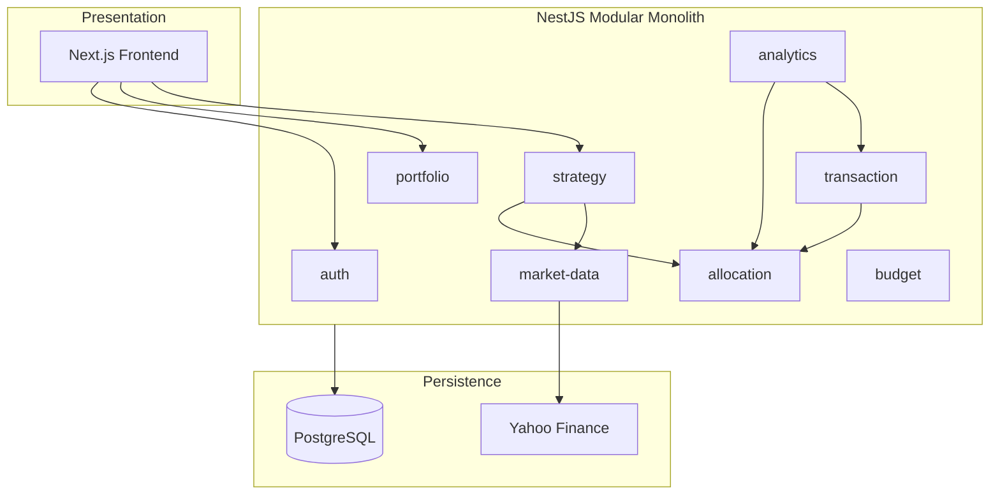

# Architecture Skill — CapitalForge

> Reusable AI operating instructions for system design decisions.

## When to Use

Load when proposing new modules, changing boundaries, evaluating scalability, or making infrastructure decisions.

---

## System Design Principles

1. **Modular monolith** — one deployable, clear module boundaries (ADR-001)
2. **Budget as control knob** — all amounts derive from `totalCapital` (PRD §3)
3. **Multipliers not amounts** — strategy rules store factors, not USD/shares (ADR-002)
4. **Explicit over magic** — market sync on demand, not hidden background jobs (V1)
5. **Audit trail** — every state change timestamped (transactions, snapshots)
6. **Graceful degradation** — cached prices when Yahoo unavailable
7. **YAGNI** — no queue, no microservices, no WebSocket until needed

---

## Module Boundary Rules



**Rules:**
- Modules communicate via injected services, not shared global state
- Analytics is read-only — never mutates state
- Market data module owns all Yahoo interactions
- Strategy orchestrates but doesn't own allocation persistence logic

---

## API Boundary Rules

- All client access through REST API — no direct DB access from frontend
- Portfolio-scoped routes: `/api/portfolios/:id/<resource>`
- Cross-portfolio operations forbidden in V1
- No GraphQL, no gRPC in V1
- Version prefix (`/api/v2`) only when breaking changes unavoidable

---

## Event-Driven Architecture Guidance

**V1:** Synchronous request/response only.

**When to introduce events (V2+):**
- Scheduled market sync (cron trigger)
- Email notifications on dip threshold
- Audit log streaming

**If adding events:**
1. Document in `DECISION_LOG.md`
2. Prefer simple cron over complex event bus initially
3. Consider BullMQ + Redis only when cron insufficient
4. Never make user-facing flows depend on async events in V1

---

## Distributed Systems Guidance

CapitalForge is **not** a distributed system in V1. One backend instance, one database.

**If scaling beyond single instance:**
- Backend is stateless (JWT) — horizontal scaling OK
- Database connection pooling required (Supabase pgbouncer)
- No sticky sessions needed
- Watch for: concurrent bucket updates (use DB transactions)

---

## Cloud-Native Guidance

| Concern | Current | Best Practice |
|---------|---------|---------------|
| Config | Env vars | Keep secrets in platform dashboard, not code |
| Health checks | `/api/health` | Maintain for Render |
| Logging | stdout | Structured JSON if adding log aggregation |
| Migrations | Prisma migrate deploy | Run in CI/CD pipeline |
| Static assets | Vercel CDN | Frontend only |
| Database | Supabase managed | Backups enabled |

---

## Scaling Guidance

### Current capacity (adequate for V1)
- 1-10 users
- 5-20 stocks per portfolio
- Hundreds of transactions
- On-demand market sync

### Scale triggers and responses

| Trigger | Response |
|---------|----------|
| > 1000 transactions | Add pagination (F-012) |
| > 50 stocks | Batch market sync, cache snapshots |
| > 100 concurrent users | Connection pool tuning, read replicas |
| Real-time prices needed | WebSocket or polling interval (V2) |
| Multiple portfolios per user | Already supported via userId FK |

---

## Security Architecture

```
Browser → HTTPS → Vercel (frontend)
Browser → HTTPS → Render (API) → JWT validation → Service → Prisma → PostgreSQL
Render → HTTPS → Yahoo Finance (external)
```

- No direct DB access from frontend
- JWT in Authorization header
- bcrypt password storage
- CORS whitelist
- Row-level security (future): enforce portfolio.userId === req.user.id

---

## Decision Framework

Before proposing architectural change, answer:

1. **Does PRD require this?** If no, defer.
2. **Is there an existing ADR?** If yes, follow or supersede with new ADR.
3. **What's the simplest solution?** Prefer monolith patterns.
4. **What's the blast radius?** Minimize modules affected.
5. **Can it be reversed?** Prefer additive changes.

Document all "yes" to #3 that affect boundaries in `DECISION_LOG.md`.

---

## Anti-Patterns

| Anti-Pattern | Why |
|--------------|-----|
| Microservices for < 100 users | Operational overhead |
| Event sourcing for transaction ledger | Over-engineering |
| Caching layer before measuring | Premature optimization |
| Shared mutable state between requests | Breaks horizontal scaling |
| Direct Yahoo calls from frontend | API key exposure, CORS |

---

## Related Documents

- [ARCHITECTURE.md](../docs/ARCHITECTURE.md) — Detailed diagrams
- [DECISION_LOG.md](../docs/DECISION_LOG.md) — ADRs
- [PROJECT_CONTEXT.md](../docs/PROJECT_CONTEXT.md) — Business rules
