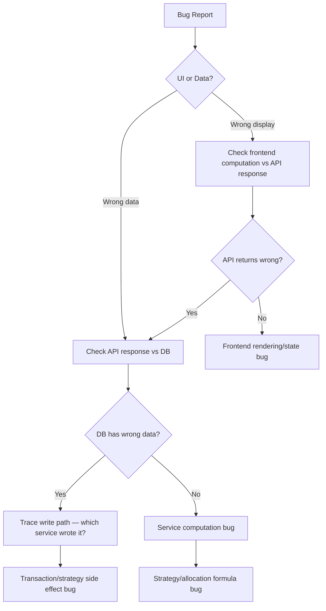

# Debugging Skill — CapitalForge

> Reusable AI operating instructions for root cause analysis and issue resolution.

## When to Use

Load when investigating bugs, unexpected behavior, performance issues, or production incidents.

---

## Root Cause Analysis Process

```
1. REPRODUCE    → Confirm the bug with exact steps
2. ISOLATE      → Which layer? (frontend / API / DB / external)
3. EVIDENCE     → Logs, network tab, DB state, API response
4. HYPOTHESIZE  → Form theory based on evidence
5. VERIFY       → Test hypothesis with minimal change
6. FIX          → Minimal targeted fix
7. REGRESS      → Verify fix + check for side effects
8. DOCUMENT     → Update KNOWN_ISSUES.md, close FEATURE_BACKLOG item
```

---

## Layer Isolation Strategy



**Quick isolation commands:**

```bash
# Check API directly
curl -H "Authorization: Bearer $TOKEN" http://localhost:3001/api/portfolios/$ID/allocations

# Check DB
cd backend && npx prisma studio

# Check backend logs
# (watch terminal running npm run start:dev)
```

---

## Common Bug Patterns

| Symptom | Likely Cause | Check |
|---------|-------------|-------|
| Buy amounts don't match Excel | Multiplier not used / wrong weeklyDCA | strategy.service, allocation buckets |
| Budget change has no effect | recalculateBuckets not called | portfolio.service update path |
| Bucket remaining wrong | executeBuyPlan missing decrement | strategy.service BUG-003 |
| Shares drift after edit | No transaction reversal | transaction.service BUG-004 |
| 401 on all requests | Token expired or bypass removed | localStorage, auth guard |
| CORS error | Origin not in allowed list | CORS_ORIGINS env var |
| Market sync fails | Yahoo API down/rate limit | backend logs, retry config |
| Strategy shows equal amounts | Equal-split logic still active | strategy.service BUG-002 |

---

## Logging Approach

### Backend investigation

```typescript
// Temporary debug logging (remove before merge)
this.logger.debug(`Allocation weeklyDCA: ${allocation.weeklyDCA}, multiplier: ${rule.buyMultiplier}`);
this.logger.debug(`Computed buyUSD: ${buyUSD}, shares: ${buyShares}`);
```

### Frontend investigation

```javascript
// Browser console — check API response
// Network tab → filter XHR → inspect response body
// React DevTools → check context state (auth, portfolio)
```

### Database investigation

```sql
-- Via Prisma Studio or direct query
SELECT symbol, weekly_dca, core_used_usd, core_remaining_usd
FROM allocations WHERE portfolio_id = 'xxx';

SELECT * FROM strategy_rules WHERE portfolio_id = 'xxx' ORDER BY symbol, dip_percent;
```

---

## Performance Debugging

| Symptom | Investigation |
|---------|---------------|
| Strategy page slow | Time market sync vs render; check number of API calls |
| Dashboard slow | Check analytics endpoint response size |
| DB slow | EXPLAIN ANALYZE on slow queries; check missing indexes |
| Render cold start | Expected on free tier; check health endpoint latency |

**Backend timing:**
```typescript
const start = Date.now();
await this.marketDataService.sync(symbols);
this.logger.log(`Market sync took ${Date.now() - start}ms`);
```

---

## Production Debugging Checklist

```
□ Check Render logs for errors
□ Verify GET /api/health returns 200
□ Confirm env vars set correctly (JWT_SECRET, DATABASE_URL, CORS_ORIGINS)
□ Check Supabase dashboard for connection limits
□ Verify frontend NEXT_PUBLIC_API_URL points to correct backend
□ Test login flow end-to-end
□ Check if AuthBypassMiddleware is active (should NOT be in prod)
□ Review recent deployments (Render + Vercel)
□ Check if migration was applied (prisma migrate status)
□ Verify Yahoo Finance is reachable from Render
```

---

## Strategy Calculation Verification

When debugging wrong buy amounts, trace the derivation chain:

```
1. Portfolio.totalCapital = ?
2. Allocation.targetPercentage = ?
3. Portfolio.coreRatio = ? (should be 0.60)
4. allocationUSD = totalCapital × targetPercent / 100
5. coreBucketUSD = allocationUSD × coreRatio
6. weeklyDCA = coreBucketUSD / dcaWeeksPerYear (should be 48)
7. buyUSD = weeklyDCA × buyMultiplier
8. buyShares = floor(buyUSD / currentPrice)
```

Compare step 7 against Excel expected values (PRD §3.2):
- NVDA at $23,639 budget: weeklyDCA ≈ $73.87, 20% buy ≈ $221.62

---

## Post-Fix Documentation

After fixing a bug:

1. Remove `KNOWN_ISSUES.md` entry or mark resolved
2. Update `FEATURE_BACKLOG.md` status to Done
3. Add `TIME_LOG.md` entry
4. Add test to prevent regression (see testing-skill.md)
5. Update `RELEASE_NOTES.md` if shipping

---

## Related Skills

- [backend-skill.md](./backend-skill.md) — Service layer
- [testing-skill.md](./testing-skill.md) — Regression tests
- [KNOWN_ISSUES.md](../docs/KNOWN_ISSUES.md) — Known bugs
